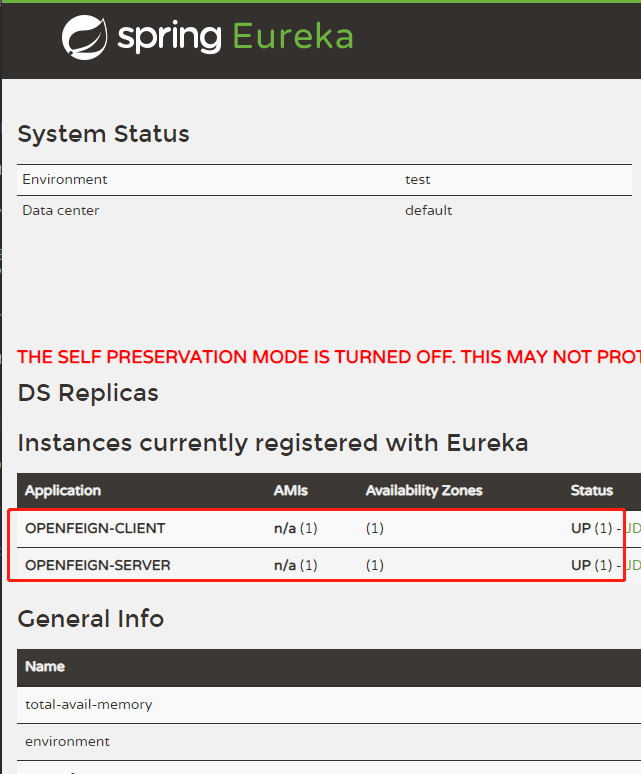

## Spring Cloud OpenFeign Demo

## 如何运行

本项目的模块都是以spring boot构建的，直接在编译器中运行Main方法即可启动。

1. 启动openfeign-registry-server

openfeign-registry-server会启动eureka server,供后面的OpenFeignServer和OpenFeignClient注册。

可以访问注册中心查看服务注册情况
http://127.0.0.1:8761/

2. 启动openfeign-server

3. 启动openfeign-client

4. 测试openFeignClient

get请求url：  http://localhost:8000/getUserName2

查看日志，看看输出吧。

本项目代码地址 ：[spring-cloud-openfeign-demo](https://github.com/sycdesign/spring-cloud-openfeign-demo)
